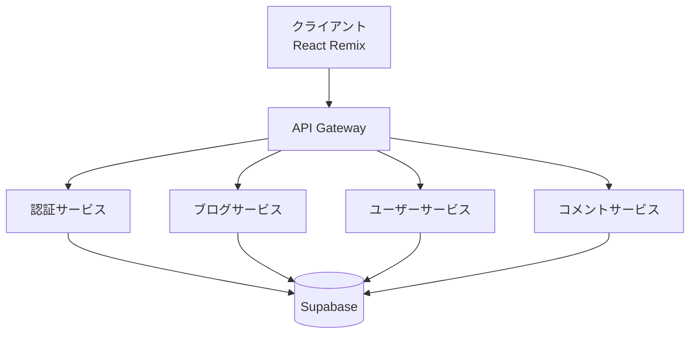

# システムアーキテクチャ設計

## 全体構成

## マイクロサービス構成

### 1. API Gateway

- 役割：
  - リクエストのルーティング
  - レート制限
  - リクエスト/レスポンスの変換
  - キャッシュ制御
- 技術スタック：
  - Rust + Axum

### 2. 認証サービス

- 役割：
  - ユーザー認証
  - JWT トークン発行・検証
  - セッション管理
- 技術スタック：
  - Rust + Axum
  - Supabase Auth

### 3. ブログサービス

- 役割：
  - 記事の作成・編集・削除
  - カテゴリ管理
  - タグ管理
  - 記事検索
- 技術スタック：
  - Rust + Axum
  - Supabase Database

### 4. ユーザーサービス

- 役割：
  - ユーザープロフィール管理
  - ユーザー設定
  - フォロー/フォロワー管理
- 技術スタック：
  - Rust + Axum
  - Supabase Database

### 5. コメントサービス

- 役割：
  - コメントの作成・編集・削除
  - コメントモデレーション
  - 通知管理
- 技術スタック：
  - Rust + Axum
  - Supabase Database

## 通信方式

### サービス間通信

- gRPC
  - 高パフォーマンス
  - 型安全
  - 双方向ストリーミング対応

### クライアント-サーバー間通信

- REST API
  - シンプルで理解しやすい
  - キャッシュ制御が容易
  - ブラウザとの互換性が高い

## デプロイメント

- Docker コンテナ化
- Kubernetes 上での運用を想定
- 各サービスの独立したスケーリング
